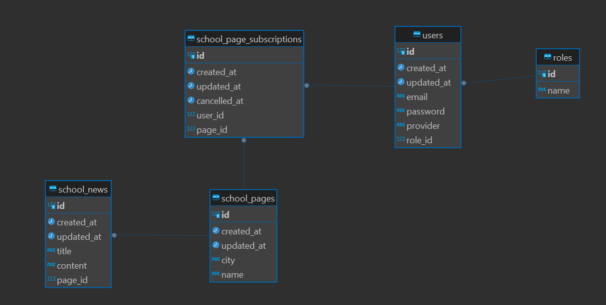

# 클래스팅 백엔드 사전 과제

### prerequisite

> docker
> docker compose v2
> node
> yarn

### 구동 방법

1. 단위 테스트

```bash
yarn
yarn test
```

2. e2e 테스트

- .env.test 파일 생성

```bash
# .env.test 예시
APP_PORT=3000
DATABASE_HOST=localhost
DATABASE_USER=postgres
DATABASE_PASSWORD=postgres
DATABASE_PORT=5432
DATABASE_NAME=develop
SESSION_SECRET=secret
REDIS_HOST=localhost
REDIS_PORT=6379
```

- 실행

```bash
yarn test:e2e
```

3. 애플리케이션 실행

- 과제 제출 편의상 실행 환경 변수 파일 `.env.production` 이 레포지토리에 추가되어 있습니다

```bash
yarn start:prod
```

### API 명세

> 애플리케이션 실행 후 `{애플리케이션 주소}/docs` 로 접근 ex) localhost/docs
> 

### ERD



#### roles

- 역할(관리자, 멤버) 를 정의하는 엔티티입니다.

#### users

- 유저를 정의하는 엔티티입니다.
- email은 `unique` 입니다
- provider는 추후 oAuth 방식 로그인 확장을 대비한 컬럼입니다.

#### school_pages

- 학교 페이지를 정의하는 엔티티입니다.
- city, name 쌍은 `unique` 입니다.

#### school_news

- 학교 페이지의 소식을 정의하는 엔티티입니다.
- 하나의 학교 페이지는 다수의 소식을 가질 수 있습니다. (1:N)

#### school_page_subscriptions

- 유저의 학교 페이지 구독 정보를 정의하는 엔티티입니다.
- 구독 취소 시 레코드를 삭제하지 않고 `canceled_at` 컬럼에 취소 날짜를 표기합니다.

### Directory

```bash
src/users
├── index.ts
├── persistence
│   ├── entities
│   └── repositories
├── presentation
│   ├── controllers
│   └── dtos
├── usecase
│   ├── dtos
│   └── services
└── user.module.ts
```

- **usecase**: 비즈니스 로직을 담당하는 레이어
- **presentation**: 외부 클라이언트의 요청과 응답을 담당하는 레이어
- **persistence**: 영속성을 담당하는 레이어
- 레이어끼리의 통신은 각 레이어에 정의된 `dto` 로 요청 / 응답 합니다

### 간략한 사용법

- 역할 조회 후 필요에 따라 관리자 혹은 멤버(학생) 로 회원 가입 할 수 있습니다.
- 유저 인증은 `세션, 쿠키` 방식을 사용 합니다. **로그인 시 브라우저의 쿠키에 저장됩니다.**
- user, auth 를 제외한 모든 api는 로그인이 필요합니다.

### Test

- 유닛 테스트는 service class 만을 대상으로 단순히 `repository` 에서 값을 반환하는 함수를 제외한 로직만 테스트를 추가했습니다.
- e2e 테스트 시 db는 `pg-mem` in-memory postgresql 라이브러리를 사용했습니다.
